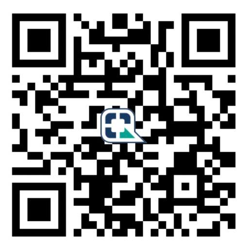

# SuperRich - Real-time Myanmar Exchange Platform

## 🌐 Live Platform: [https://superrich.tech](https://superrich.tech)

SuperRich is a professional-grade, real-time currency and commodity exchange dashboard specifically designed for the Myanmar market. It provides traders and users with accurate, live exchange rates, professional charting tools, and a seamless interface for monitoring global market trends.

## ✨ Features

-   **🌍 Real-time Global Rates**: Live P2P exchange rates for MMK (Myanmar Kyat), THB (Thai Baht), TWD (New Taiwan Dollar), and many more, fetched directly via proxy from Binance P2P.
-   **📊 Professional Charting**: High-performance interactive charts powered by `lightweight-charts` (TradingView), allowing for technical analysis on multiple timeframes.
-   **📉 Dynamic Order Book**: Real-time visualization of market liquidity and depth.
-   **🧮 Exchange Calculator**: Integrated tool for quick currency conversions and trade estimations.
-   **📱 Mobile Optimized**: A fully responsive, "mobile-first" design that ensures a premium experience on any device.
-   **🔒 Secure Infrastructure**: Backend proxying for API requests, rate limiting, and robust security headers to protect against threats.
-   **🌙 Premium Aesthetics**: A sleek, dark-themed UI with elegant gold accents, built for high-density information delivery.

## 🤝 Support

If you find this project helpful, consider supporting the development:

-   **Bitcoin (BTC)**: `12yhkkbbjjqC2cdujWFfCggrDGLmqta262` (Network: BTC)

### 💳 Other Payment Methods

| Binance Pay | PromptPay | KBZ Pay |
| :---: | :---: | :---: |
|  |  |  |

---

*Disclaimer: SuperRich is an independent project and is not affiliated with Super Rich Thailand.*