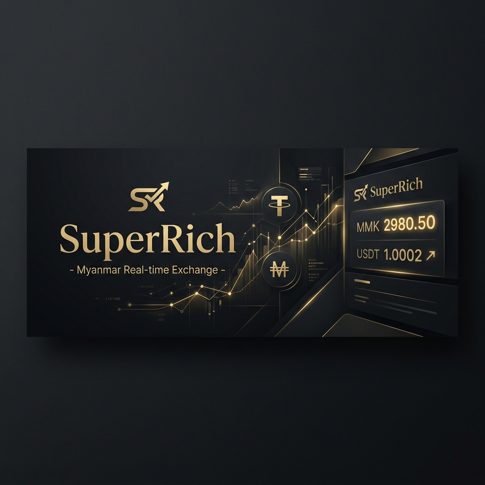

# SuperRich - Real-time Myanmar Exchange Platform

[](https://superrich.tech)

## 🌐 Live Platform: [https://superrich.tech](https://superrich.tech)

SuperRich is a professional-grade, real-time currency and commodity exchange dashboard specifically designed for the Myanmar market. It provides traders and users with accurate, live exchange rates, professional charting tools, and a seamless interface for monitoring global market trends.

## ✨ Features

-   **🌍 Real-time Global Rates**: Live P2P exchange rates for MMK (Myanmar Kyat), THB (Thai Baht), TWD (New Taiwan Dollar), and many more, fetched directly via proxy from Binance P2P.
-   **📊 Professional Charting**: High-performance interactive charts powered by `lightweight-charts` (TradingView), allowing for technical analysis on multiple timeframes.
-   **📉 Dynamic Order Book**: Real-time visualization of market liquidity and depth.
-   **🧮 Exchange Calculator**: Integrated tool for quick currency conversions and trade estimations.
-   **📱 Mobile Optimized**: A fully responsive, "mobile-first" design that ensures a premium experience on any device.
-   **🔒 Secure Infrastructure**: Backend proxying for API requests, rate limiting, and robust security headers to protect against threats.
-   **🌙 Premium Aesthetics**: A sleek, dark-themed UI with elegant gold accents, built for high-density information delivery.

## 🚀 Tech Stack

### Frontend
-   **React**: Core UI framework.
-   **Vite**: Next-generation frontend tooling for fast development.
-   **Tailwind CSS**: Utility-first CSS for a custom, professional design.
-   **Lucide React**: Clean and consistent iconography.
-   **Lightweight Charts**: High-performance financial charts.

### Backend
-   **Node.js & Express**: Scalable backend server handling API orchestration.
-   **Axios**: For reliable communication with external APIs (Binance, MEXC, Coinlore).
-   **Dotenv**: Secure environment variable management.

## 🛠️ Getting Started

### Prerequisites
-   Node.js (v18 or higher)
-   npm or yarn

### Installation

1.  **Clone the repository**:
    ```bash
    git clone https://github.com/realjackhalder/superrich.git
    cd superrich
    ```

2.  **Install dependencies**:
    ```bash
    npm install
    ```

3.  **Configure Environment Variables**:
    Create a `.env` file in the `server/` directory and add your API keys:
    ```env
    PORT=3001
    BINANCE_API_KEY=your_binance_key
    BINANCE_API_SECRET=your_binance_secret
    BINANCE_TH_API_KEY=your_binance_th_key
    MEXC_SECRET_KEY=your_mexc_key
    ```

4.  **Run the application**:
    -   **Frontend**: `npm run dev`
    -   **Backend**: `node server/server.js`

## 🌐 Deployment

The platform is optimized for deployment on **Vercel**. 
-   Frontend build is handled via `vite build`.
-   Serverless functions are located in the `/api` directory for seamless Vercel integration.

## 🤝 Support

If you find this project helpful, consider supporting the development:

-   **Bitcoin (BTC)**: `12yhkkbbjjqC2cdujWFfCggrDGLmqta262` (Network: BTC)

### 💳 Other Payment Methods

| Binance Pay | PromptPay | KBZ Pay |
| :---: | :---: | :---: |
|  |  |  |
| *Scan to Support* | *Scan to Support* | *Scan to Support* |

---

*Disclaimer: SuperRich is an independent project and is not affiliated with Super Rich Thailand.*